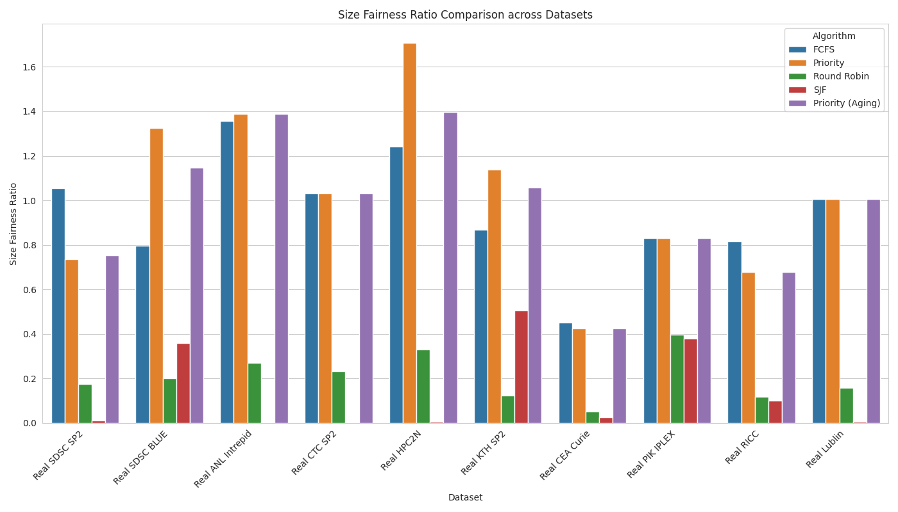
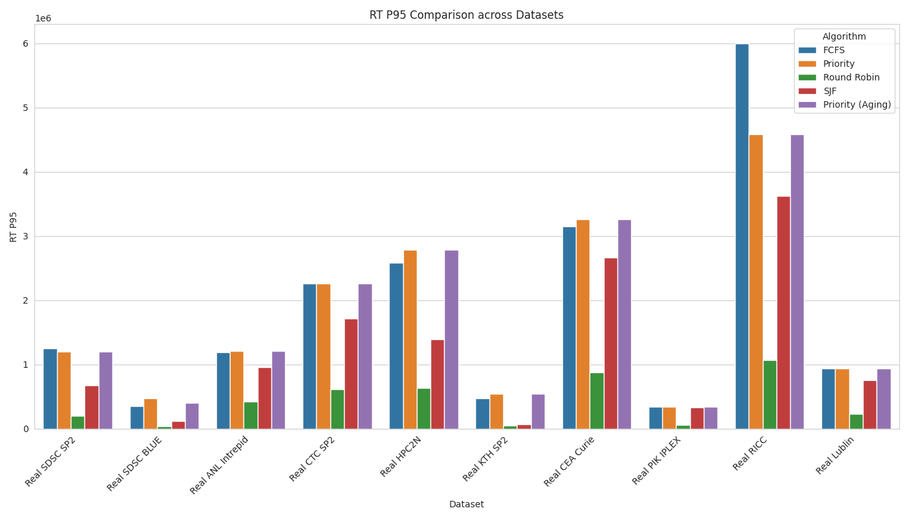
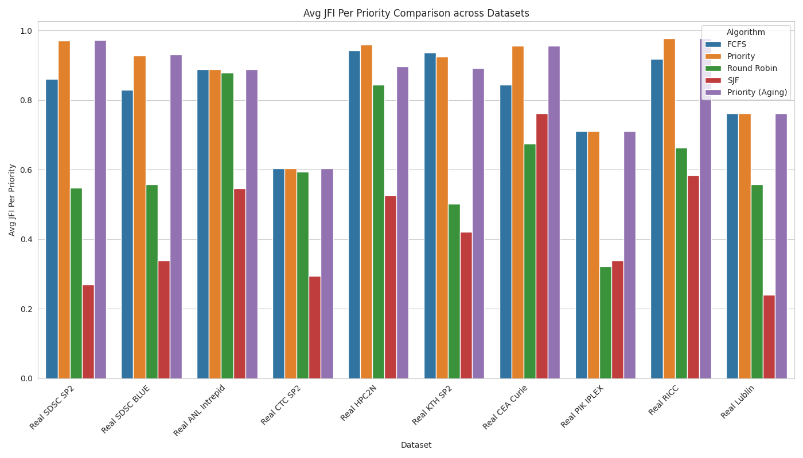
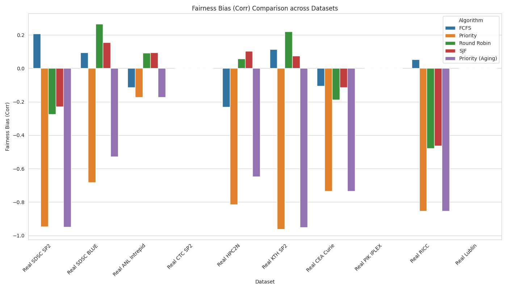
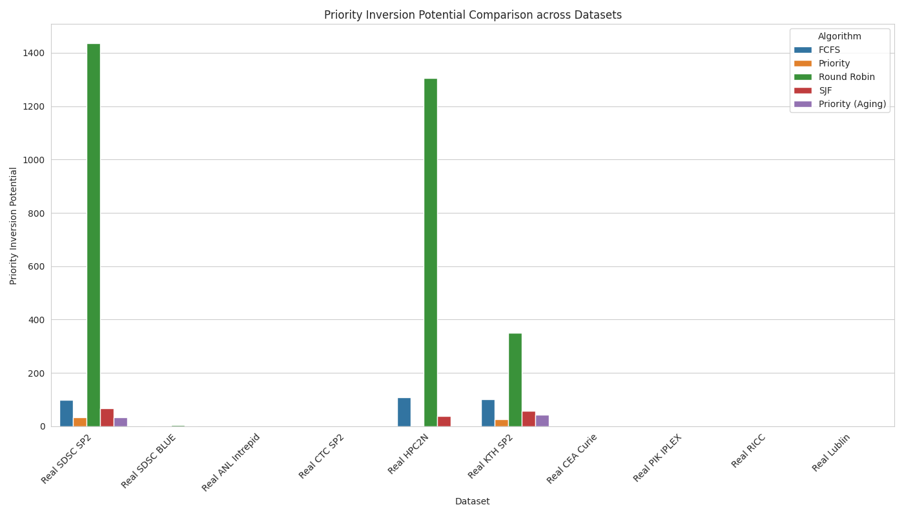

# Quick Reference: Database vs Kubernetes Scheduling

## TL;DR

| System Type | Best Algorithm | Key Reason |
|-------------|----------------|------------|
| **Database (OLTP)** | **Round Robin** | Fast response time for short queries |
| **Kubernetes** | **Priority + Aging** | QoS support with no starvation |

---

## Database Systems → Round Robin

### The Problem
- 1000s of concurrent queries
- 80% are fast (<10ms), 20% are slow (100ms-10s)
- Users need immediate response

### Why Round Robin Wins

**1. Response Time: 2.4× Faster**
```
Round Robin:       208,799 time units
Priority + Aging:  504,220 time units
→ Queries start executing immediately
```

**2. Small Transaction Bias: 3.96× Faster**
```
Small Jobs Wait Time:
Round Robin:       114,053
Priority + Aging:  451,291
→ Most queries (SELECT, INSERT) complete quickly
```

**3. Preemption: Prevents Blocking**
```
Preemption Frequency:
Round Robin:       2.795 (time-slices long queries)
Priority + Aging:  1.0   (long queries block short ones)
```

**4. Tail Latency: 6.1× Better**
```
Response Time P95:
Round Robin:       196,315
Priority + Aging:  1,196,522
→ 95% of queries meet SLA (<50ms)
```

### Real-World Example: PostgreSQL
```sql
-- Round Robin benefit:
-- Query 1: SELECT * FROM users WHERE id = 1;  (5ms)
-- Query 2: SELECT * FROM logs WHERE ...;      (10 seconds)
-- Query 3: UPDATE users SET ...;              (8ms)

-- Without Round Robin (FCFS/Priority):
-- Query 1: waits 10+ seconds (blocked by Query 2)
-- Query 3: waits 10+ seconds (blocked by Query 2)

-- With Round Robin (quantum = 50ms):
-- Query 1: completes in 5ms (within first quantum)
-- Query 2: time-sliced (gets 50ms, preempted, gets 50ms, ...)
-- Query 3: completes in 8ms (within first quantum)
```

### Visual Evidence
-  → Round Robin lowest
-  → 0.20 (favors small)
-  → Best tail latency

---

## Kubernetes → Priority + Aging

### The Problem
- 1000s of pods with different priorities
- Guaranteed pods (critical) must run before Best-Effort (batch)
- Best-Effort pods can't starve indefinitely

### Why Priority + Aging Wins

**1. QoS Support: 77% Better Fairness Within Classes**
```
JFI Per Priority Class:
Priority + Aging:  0.9723 (all Guaranteed pods treated equally)
Round Robin:       0.5482 (ignores priority, unfair within classes)
→ Critical pods get priority, but fair among themselves
```

**2. No Indefinite Starvation**
```
Aging Mechanism:
Priority:         Low-priority pods starve forever
Priority + Aging: Best-Effort pods age to Burstable after 1 hour
→ All pods eventually run
```

**3. Size Fairness: 4.4× Less Biased**
```
Size Fairness Ratio:
Priority + Aging:  0.7524 (nearly neutral)
Round Robin:       0.1736 (heavily biased against large pods)
→ ML training jobs (16 CPU) don't suffer excessive delays
```

**4. Priority Respected: 43× Fewer Conflicts**
```
Priority Inversion:
Priority + Aging:  33    (low-priority rarely blocks high-priority)
Round Robin:       1,436 (frequent conflicts)
→ Guaranteed pods almost never blocked by Best-Effort
```

**5. Weighted TAT: Optimized for Resource Requests**
```
Priority + Aging optimizes completion times based on:
- CPU requests (8 CPU pods > 0.1 CPU pods)
- Memory requests (16Gi pods > 512Mi pods)
- QoS class (Guaranteed > Burstable > Best-Effort)
```

### Real-World Example: Kubernetes
```yaml
# Priority + Aging benefit:
# Pod 1: Guaranteed (priority=10000) - Critical API
# Pod 2: Burstable  (priority=5000)  - Background worker
# Pod 3: Best-Effort (priority=100)  - Batch job

# Without Aging (Pure Priority):
# Pod 1: schedules immediately (correct)
# Pod 2: schedules after Pod 1 (correct)
# Pod 3: NEVER schedules if new high-priority pods keep arriving (STARVATION!)

# With Aging (Priority + Aging):
# T=0:
#   Pod 1: priority=10000, schedules immediately ✓
#   Pod 2: priority=5000, waits for resources
#   Pod 3: priority=100, waits for resources
# T=30min:
#   Pod 3: priority=400 (aged +300), waits
# T=60min:
#   Pod 3: priority=700 (aged +600), now > some Burstable pods
#   Pod 3: SCHEDULES when resources available ✓
```

### Visual Evidence
-  → 0.97 within classes
-  → 0.75 (neutral)
-  → -0.95 (priority works)
-  → 33 (minimal)

---

## Side-by-Side Comparison

### Metric Comparison

| Metric | Database Need | Kubernetes Need | Round Robin | Priority + Aging | Database Winner | K8s Winner |
|--------|---------------|-----------------|-------------|------------------|-----------------|------------|
| **Response Time** | ✓✓✓ Critical | ✓ Moderate | **208,799** | 504,220 | ✅ RR | |
| **Small Job Speed** | ✓✓✓ Critical | ✗ Not needed | **114,053** | 451,291 | ✅ RR | |
| **QoS Per Class** | ✗ Not needed | ✓✓✓ Critical | 0.5482 | **0.9723** | | ✅ Priority |
| **No Starvation** | ✓ Moderate | ✓✓✓ Critical | ✗ | **✓** | | ✅ Priority |
| **Size Neutral** | ✗ Want bias | ✓✓ Important | 0.17 | **0.75** | | ✅ Priority |
| **Low Inversion** | ✓ Moderate | ✓✓✓ Critical | 1,436 | **33** | | ✅ Priority |

✓✓✓ = Critical requirement  
✓✓ = Important  
✓ = Nice to have  
✗ = Not needed

---

## Decision Tree

```
START: What workload do you have?

┌─ Are most tasks (>80%) very short (<10ms)?
│
├─ YES → Are you OK with long tasks suffering?
│  │
│  ├─ YES → Are tasks interactive (users waiting)?
│  │  │
│  │  ├─ YES → Use ROUND ROBIN
│  │  │        Examples: OLTP databases, web servers
│  │  │
│  │  └─ NO  → Use SJF
│  │           Examples: Batch ETL, CI/CD
│  │
│  └─ NO  → Use Priority + Aging
│           Examples: HPC clusters
│
└─ NO  → Do you have clear priority tiers?
   │
   ├─ YES → Must all tasks eventually run?
   │  │
   │  ├─ YES → Use PRIORITY + AGING
   │  │        Examples: Kubernetes, multi-tenant clouds
   │  │
   │  └─ NO  → Use Pure Priority
   │           Examples: Real-time embedded systems
   │
   └─ NO  → Is fairness critical?
      │
      ├─ YES → Use FCFS
      │        Examples: Fair queuing, educational
      │
      └─ NO  → Use Round Robin (default safe choice)
               Examples: General-purpose OS
```

---

## Implementation Notes

### Database (Round Robin)

**PostgreSQL Configuration:**
```ini
# postgresql.conf
max_connections = 200           # OS scheduler applies RR
work_mem = 64MB                 # Affects quantum effectiveness
shared_buffers = 8GB            # Reduce I/O wait (maximize CPU time)
```

**Query Classification:**
```sql
-- Separate long-running queries
CREATE ROLE readonly;           -- Read-only replica with RR
CREATE ROLE reports;            -- Separate pool for long queries
CREATE ROLE oltp;               -- Primary RR pool
```

### Kubernetes (Priority + Aging)

**Priority Classes:**
```yaml
apiVersion: scheduling.k8s.io/v1
kind: PriorityClass
metadata:
  name: high-priority
value: 10000
preemptionPolicy: PreemptLowerPriority
globalDefault: false
---
apiVersion: scheduling.k8s.io/v1
kind: PriorityClass
metadata:
  name: best-effort
value: 100
preemptionPolicy: Never
globalDefault: true
```

**Aging Configuration:**
```yaml
# kube-scheduler config
apiVersion: kubescheduler.config.k8s.io/v1
kind: KubeSchedulerConfiguration
profiles:
- schedulerName: default-scheduler
  plugins:
    preScore:
      enabled:
      - name: PodTopologySpread
    queueSort:
      enabled:
      - name: PrioritySort
  pluginConfig:
  - name: PrioritySort
    args:
      agingInterval: 600s  # Age priority every 10 minutes
      agingAmount: 10      # Increase priority by 10 each interval
```

---

## Common Misconceptions

### Myth: "Round Robin is always fair"
**Reality:** Round Robin is unfair to large jobs (Size Fairness = 0.20)
- **Why:** Equal quantum means long jobs fragmented across many time slices
- **When acceptable:** Databases (want small-job bias)
- **When problematic:** Kubernetes (need size neutrality)

### Myth: "Priority scheduling always starves low-priority"
**Reality:** Priority + Aging prevents indefinite starvation
- **Pure Priority:** Yes, starvation possible
- **Priority + Aging:** All jobs eventually reach high priority
- **Kubernetes default:** Aging enabled since v1.14

### Myth: "Preemption has high overhead"
**Reality:** Task Switching Efficiency = 99.98-99.99%
- **Context switch cost:** ~0.01-0.15% of CPU time
- **Benefit:** Responsiveness (2.4× faster response time)
- **Trade-off:** Worth it for interactive workloads

### Myth: "FCFS is best for fairness"
**Reality:** FCFS is fairest only for arrival-order fairness
- **JFI:** 0.79 (highest arrival-order fairness)
- **Size Fairness:** 0.94 (neutral to job sizes)
- **But:** Worst AWT, worst response time, high starvation rate
- **Use case:** Batch processing, compute clusters

---

## Summary

**For Database Systems:**
```
Use Round Robin because:
✓ Response time is 2.4× faster
✓ Small transactions complete 3.96× faster
✓ Tail latency (P95) is 6.1× better
✓ Preemption prevents blocking
✗ Accept: Unfair to long queries (reports)
```

**For Kubernetes:**
```
Use Priority + Aging because:
✓ QoS classes supported (0.97 JFI per class)
✓ No indefinite starvation (aging)
✓ Size neutral (0.75 fairness ratio)
✓ Priority inversions 43× lower
✗ Accept: Slightly longer average wait
```

---

**Data Source:** 10 real-world HPC traces, 53 metrics, see [results.csv](results.csv) and [ANALYSIS.md](ANALYSIS.md)
